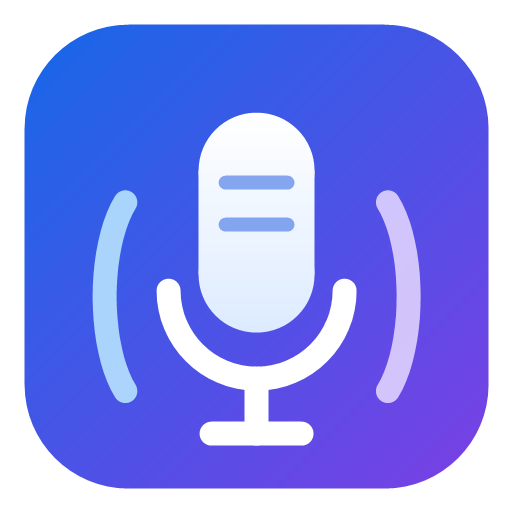

# VoyceTTS：为 STranslate 实现在线与离线双模式 TTS

VoyceTTS 是一个面向 STranslate 的 Windows TTS 插件。它提供 Edge-compatible 在线语音合成，并在网络服务失败时回退到 Windows SAPI。在线模式默认可以直接使用公共网关，离线模式则完全不需要 API Key。

本文记录这个插件从需求分析、技术选型、编码、打包排错到 GitHub 发布的完整过程，并在最后给出安装和使用方法。



## 本节重点

- 理解 STranslate 社区 TTS 插件的基本结构和运行链路。
- 实现在线 Edge-compatible TTS 和 Windows SAPI 离线合成。
- 让在线失败自动回退到本地语音，同时正确处理取消操作。
- 解决 NuGet 版本、运行时依赖打包和错误图标进入 Git 历史的问题。
- 使用 GitHub Actions 自动构建并发布 `.spkg` 安装包。
- 在 STranslate 中安装、配置和使用 VoyceTTS。

## 一、项目背景与目标

现有的一些 STranslate TTS 插件依赖平台账号、API Key 或付费额度。内置 Edge TTS 插件则依赖远程中转接口，一旦服务地址失效，朗读功能也会受到影响。

本次开发需要同时满足以下目标：

1. 用户不申请私人 API Key 也能使用。
2. 国内网络环境可以访问默认在线服务。
3. 在线服务失效时仍然能够朗读。
4. 不修改 STranslate 主程序源码，以独立社区插件形式安装。
5. 遵循 STranslate 社区插件的 `.NET 10 + WPF + .spkg` 规范。
6. 源码和安装包发布到 GitHub。

仅修复一个固定 Edge TTS 地址仍然存在单点故障，因此最终采用双后端设计：

| 后端 | 优点 | 限制 |
| --- | --- | --- |
| Edge-compatible 在线服务 | 音色自然、语言和音色选择丰富 | 依赖网络和第三方网关可用性 |
| Windows SAPI | 完全离线、不需要 API Key | 音质和音色取决于系统安装的语音包 |

默认模式为 `Auto`：先请求在线服务，失败后自动改用 SAPI。用户也可以强制选择仅在线或仅离线。

> [!warning]
> 默认 Okraworks 地址属于第三方公共网关，可能出现限流、接口调整或停止服务。VoyceTTS 允许修改地址和公共访问参数，并提供离线回退，但不对第三方服务作可用性承诺。

## 二、插件架构与数据流

STranslate 的 TTS 插件需要实现 `ITtsPlugin`。宿主负责插件生命周期、HTTP 客户端、设置存储、日志和最终音频播放，插件负责把文本转换成明确格式的音频数据。

VoyceTTS 的调用流程如下：

```text
用户点击朗读
    |
    v
PlayAudioAsync(text, cancellationToken)
    |
    +-- Offline ----------------------> Windows SAPI -> WAV -> 宿主播放器
    |
    +-- Online -----------------------> HTTP TTS -> MP3 -> 宿主播放器
    |
    +-- Auto -> HTTP TTS 成功 --------> MP3 -> 宿主播放器
              HTTP TTS 失败
                    |
                    +---------------> Windows SAPI -> WAV -> 宿主播放器
```

主要文件职责：

| 文件 | 职责 |
| --- | --- |
| `Main.cs` | 插件入口、在线合成、SAPI 合成和自动回退 |
| `Settings.cs` | 保存运行模式、在线参数和 SAPI 参数 |
| `SettingsView.cs` | 设置界面、试听、语音列表和自动保存 |
| `plugin.json` | 插件名称、稳定 ID、版本和入口 DLL |
| `STranslate.Plugin.Tts.VoyceTTS.csproj` | .NET、依赖、输出目录和 `.spkg` 打包配置 |
| `.github/workflows/release.yml` | Tag 推送后的自动构建和 GitHub Release 发布 |

## 三、准备开发环境

项目面向 Windows 和 `.NET 10`，开发机需要安装 .NET 10 SDK。最初尝试通过 Winget 安装，但安装程序被取消，只留下了约 206 MB 的临时安装包。确认 SDK 未安装后，删除该临时目录，改用 Scoop：

```powershell
scoop search dotnet-sdk
scoop install dotnet-sdk
```

实际安装版本为 `dotnet-sdk 10.0.400`。可以通过下面的命令确认：

```powershell
dotnet --info
```

> [!tip]
> “已安装 .NET 10 运行时”和“已安装 .NET 10 SDK”不是一回事。运行时只能启动程序，执行 `dotnet build` 还需要 SDK。

## 四、建立社区插件项目

项目使用 WPF，并显式关闭上层仓库可能启用的集中包版本管理。关键配置如下：

```xml
<PropertyGroup>
  <TargetFramework>net10.0-windows</TargetFramework>
  <UseWPF>true</UseWPF>
  <EnableWindowsTargeting>true</EnableWindowsTargeting>
  <ManagePackageVersionsCentrally>false</ManagePackageVersionsCentrally>
  <AppendTargetFrameworkToOutputPath>false</AppendTargetFrameworkToOutputPath>
  <AppendRuntimeIdentifierToOutputPath>false</AppendRuntimeIdentifierToOutputPath>
</PropertyGroup>
```

Release 构建启用 STranslate SDK 提供的自动打包目标：

```xml
<PropertyGroup Condition="'$(Configuration)'=='Release'">
  <OutputPath>.artifacts\</OutputPath>
  <EnableAutoPackage>true</EnableAutoPackage>
</PropertyGroup>
```

`plugin.json` 中使用全新的稳定 `PluginID`。这可以避免与原 Microsoft Edge TTS 插件冲突，也保证后续升级仍被识别为同一个插件。

## 五、实现在线语音合成

### 5.1 验证接口协议

开发前先直接请求服务，确认真实接口不是网页地址本身，而是：

```text
POST https://tts.okraworks.cn/api/v1/audio/speech
Content-Type: application/json
Authorization: Bearer <公共访问参数>
```

请求体包含音色、文本、语速、音调和非流式开关：

```json
{
  "voice": "zh-CN-XiaoxiaoNeural",
  "input": "测试文本",
  "speed": 1.0,
  "pitch": 0,
  "stream": false
}
```

验证请求返回 `HTTP 200` 和 `audio/mpeg`。发布前的最后一次冒烟测试得到 16,416 字节 MP3 数据。

### 5.2 使用宿主 HTTP 与播放器

插件不自行维护全局 `HttpClient`，而是使用 `IPluginContext.HttpService`。这样可以复用宿主的代理、超时和取消机制：

```csharp
var options = new Options
{
    Timeout = TimeSpan.FromSeconds(Math.Clamp(_settings.TimeoutSeconds, 5, 300))
};

if (!string.IsNullOrWhiteSpace(_settings.ApiKey))
    options.Headers = new() { ["Authorization"] = "Bearer " + _settings.ApiKey };

var bytes = await _context.HttpService.PostAsBytesAsync(
    url,
    body,
    options,
    cancellationToken);

await _context.AudioPlayer.PlayAsync(
    new AudioData(bytes, AudioFormat.Mp3),
    cancellationToken);
```

这里有三个重要细节：

1. API Key 为空时不发送 `Authorization`，以兼容真正无鉴权的自建服务。
2. Base URL 既支持站点根地址，也支持用户直接填写完整的 `/audio/speech` 地址。
3. 明确把返回数据标记为 `AudioFormat.Mp3`，不让宿主猜测格式。

## 六、实现 Windows SAPI 离线合成

### 6.1 选择系统语音

插件通过 `SpeechSynthesizer.GetInstalledVoices()` 枚举启用的语音。选择顺序为：

1. 用户在设置中明确选择的语音。
2. 系统已安装的中文语音。
3. 与当前 UI 区域匹配的语音。
4. 第一个可用语音。

如果系统没有任何语音包，插件会返回明确错误，引导用户到 Windows 的语言和语音设置中安装。

本机验证实际检测到 5 个语音，其中包括中文的 Microsoft Huihui、Kangkang 和 Yaoyao。

### 6.2 输出 WAV 而不是裸 PCM

SAPI 直接写入内存中的 WAV 流，再通过宿主播放器播放：

```csharp
using var stream = new MemoryStream();
synth.SetOutputToWaveStream(stream);
synth.SpeakAsync(text);

// 等待合成完成后：
var bytes = stream.ToArray();
await _context.AudioPlayer.PlayAsync(
    new AudioData(bytes, AudioFormat.Wav),
    cancellationToken);
```

WAV 自带采样率、声道和位深信息，比返回没有容器头的 PCM 更不容易出现采样参数不匹配。

### 6.3 让取消操作真正生效

只把同步的 `Speak()` 包进 `Task.Run()` 并不能中断已经开始的合成。最终实现改用 `SpeakAsync()`，监听 `SpeakCompleted`，并把宿主的取消令牌连接到 `SpeakAsyncCancelAll()`：

```csharp
var completion = new TaskCompletionSource(
    TaskCreationOptions.RunContinuationsAsynchronously);

synth.SpeakCompleted += (_, e) =>
{
    if (e.Cancelled) completion.TrySetCanceled(cancellationToken);
    else if (e.Error is not null) completion.TrySetException(e.Error);
    else completion.TrySetResult();
};

synth.SpeakAsync(text);
using var registration = cancellationToken.Register(synth.SpeakAsyncCancelAll);
await completion.Task;
```

这样用户关闭窗口或取消朗读时，不会只能等待整段文本合成结束。

## 七、实现自动回退和设置界面

`PlayAudioAsync()` 是整个插件的调度入口：

```csharp
if (_settings.Mode != TtsMode.Offline)
{
    try
    {
        await PlayOnlineAsync(text, cancellationToken);
        return;
    }
    catch (OperationCanceledException)
    {
        throw;
    }
    catch (Exception ex)
    {
        _context.Logger.LogWarning(ex, "VoyceTTS online synthesis failed");
        if (_settings.Mode == TtsMode.Online || !_settings.FallbackToSapi)
            throw;
    }
}

await PlaySapiAsync(text, cancellationToken);
```

取消异常必须原样向上传播，不能被误判为网络故障后又开始离线朗读。只有真正的在线请求异常才进入回退逻辑，并通过宿主日志记录原因。

设置页覆盖以下参数：

- `Auto`、`Online`、`Offline` 三种模式。
- 在线地址、遮罩显示的访问参数、在线音色。
- 在线语速、音调和超时。
- 是否允许在线失败后回退。
- SAPI 语音、语速和音量。
- 刷新系统语音、在线试听和离线试听。

文本框在失去焦点时保存，选择框和复选框在值发生变化时保存。设置使用 `LoadSettingStorage<Settings>()` 和 `SaveSettingStorage<Settings>()` 持久化，重启 STranslate 后仍然保留。

## 八、打包过程中遇到的问题

### 8.1 把程序集版本误当成 NuGet 版本

#### 现象

最初根据已安装插件的 `.deps.json` 使用 `STranslate.Plugin 2.0.10`，还原时报错：

```text
NU1102: 找不到版本为 (>= 2.0.10) 的包 STranslate.Plugin
在 nuget.org 中找到的最接近版本: 1.0.15
```

#### 原因

已安装插件中的 `2.0.10` 是宿主构建使用的项目/程序集版本信息，并不代表 NuGet.org 已发布同版本包。社区插件必须以公共 NuGet 源中真实存在的版本为准。

#### 修复与验证

依赖改为：

```xml
<PackageReference Include="STranslate.Plugin" Version="1.0.15" />
```

修改后 NuGet 还原成功，并继续进入编译阶段。

### 8.2 `.spkg` 遗漏 `System.Speech.dll`

#### 现象

第一次成功构建后，检查 `.spkg` 内容发现其中没有 `System.Speech.dll`。开发机能编译不代表安装到另一台机器后也能加载。

#### 第一次修复为什么不够好

设置 `CopyLocalLockFileAssemblies=true` 能带上 `System.Speech.dll`，但同时把 `STranslate.Plugin.dll`、WPF UI 依赖和日志依赖都复制进包。这些程序集由宿主提供，重复携带会扩大安装包，并可能造成程序集版本冲突。

#### 最终修复

只针对 `System.Speech` 增加 MSBuild 复制目标：

```xml
<PackageReference Include="System.Speech"
                  Version="10.0.0"
                  GeneratePathProperty="true" />

<Target Name="CopySystemSpeech"
        AfterTargets="Build"
        BeforeTargets="PackageAsSpkg">
  <Copy SourceFiles="$(PkgSystem_Speech)\runtimes\win\lib\net10.0\System.Speech.dll"
        DestinationFolder="$(OutputPath)" />
</Target>
```

重新清理并构建后，包内包含所需 DLL，同时不再捆绑宿主依赖。

### 8.3 图标误用了其他项目资源

#### 现象

首版 `icon.png` 从历史图片目录中按时间猜测文件，结果误用了其他项目图片。这不仅使插件展示错误，如果直接推送，还会让错误资源永久留在 Git 历史中。

#### 修复

重新从零绘制蓝紫色麦克风和声波图标，并同时保留可审查的 `icon.svg` 源文件与插件使用的 `icon.png`。提交前没有继续沿用旧分支历史，而是从当前核验后的文件树创建新的根提交，再将 `main` 推送到远程。

#### 预防方法

- 生成资源后立即目视检查，而不是只检查文件是否存在。
- 项目资源保留可追溯的源文件。
- 未发布仓库发现敏感或错误二进制进入历史时，在首次推送前重建干净历史。
- 已发布仓库不能只做一次普通删除提交；还需要评估是否清理历史及通知已拉取仓库的协作者。

## 九、构建与验证

在项目根目录执行：

```powershell
dotnet build -c Release
```

实际结果为：

```text
已成功生成。
0 个警告
0 个错误
Created plugin package: .artifacts\plugins\STranslate.Plugin.Tts.VoyceTTS.spkg
```

最终 `.spkg` 根目录包含：

```text
icon.png
plugin.json
STranslate.Plugin.Tts.VoyceTTS.deps.json
STranslate.Plugin.Tts.VoyceTTS.dll
STranslate.Plugin.Tts.VoyceTTS.pdb
System.Speech.dll
Languages/zh-cn.json
```

发布前完成的验证包括：

| 检查项 | 实际结果 |
| --- | --- |
| Release 编译 | 通过，0 警告、0 错误 |
| Okraworks 请求 | HTTP 200，返回 `audio/mpeg` |
| 在线音频内容 | 测试响应为 16,416 字节 |
| SAPI 枚举 | 检测到 5 个可用语音 |
| `.spkg` 根结构 | `plugin.json`、入口 DLL、图标和语言文件齐全 |
| 离线依赖 | `System.Speech.dll` 已包含 |
| GitHub Actions | Release 工作流执行成功 |
| GitHub Release | `v1.0.0` 附带可下载 `.spkg` |

这里验证了编译、接口、系统语音枚举、包结构和云端发布。STranslate 内的安装与人工试听仍应作为每次发布前的最终手工验收步骤。

## 十、GitHub 自动发布

工作流监听所有以 `v` 开头的 Tag：

```yaml
on:
  push:
    tags:
      - "v*"
```

Windows Runner 安装 .NET 10，执行 Release 构建，再把生成的 `.spkg` 上传到 GitHub Release：

```yaml
- uses: actions/setup-dotnet@v4
  with:
    dotnet-version: "10.0.x"

- name: Build and package
  run: dotnet build -c Release

- name: Publish GitHub release
  uses: softprops/action-gh-release@v2
  with:
    files: |
      **/*.spkg
```

本次发布使用 `v1.0.0` 标签，Actions 构建成功。项目地址和安装包地址如下：

- 项目主页：<https://github.com/iceblyte/STranslate.Plugin.Tts.VoyceTTS>
- v1.0.0：<https://github.com/iceblyte/STranslate.Plugin.Tts.VoyceTTS/releases/tag/v1.0.0>
- 安装包：<https://github.com/iceblyte/STranslate.Plugin.Tts.VoyceTTS/releases/download/v1.0.0/STranslate.Plugin.Tts.VoyceTTS.spkg>

## 十一、安装和使用 VoyceTTS

### 11.1 安装插件

1. 打开上面的 Release 页面，下载 `STranslate.Plugin.Tts.VoyceTTS.spkg`。
2. 启动 STranslate。
3. 进入“设置 -> 插件 -> 安装插件”。
4. 选择下载的 `.spkg` 文件。
5. 如果 STranslate 提示需要重启，完成重启。

开发机也可以直接使用本地 Release 构建生成的：

```text
.artifacts/plugins/STranslate.Plugin.Tts.VoyceTTS.spkg
```

### 11.2 创建 TTS 服务

1. 进入 STranslate 的服务设置。
2. 新建一个 TTS 服务。
3. 插件选择 `VoyceTTS`。
4. 保存服务并打开 VoyceTTS 设置。

不同版本的 STranslate 菜单文字可能略有区别，核心操作是先安装插件，再基于该插件创建一个 TTS 服务。

### 11.3 选择运行模式

#### 自动模式

适合日常使用，也是默认值。插件优先使用在线音色，网络或网关失败时自动使用本机 SAPI。

#### 在线模式

只请求在线服务。可以配置：

- 服务根地址或完整 `/audio/speech` 地址。
- 服务所需的访问参数；无鉴权服务可以留空。
- Edge 音色，例如 `zh-CN-XiaoxiaoNeural`。
- 语速、音调和超时时间。

修改后点击“在线试听”。听到“VoyceTTS 在线语音测试”表示在线链路可用。

#### 离线模式

只使用 Windows SAPI，不发送文本到网络。选择系统语音后，可以调整 SAPI 语速和音量，再点击“离线试听”。

如果列表里没有合适的中文声音，需要先在 Windows 设置中安装中文语言和语音包，然后返回插件设置点击“刷新语音”。

### 11.4 开始朗读

完成服务配置后，在 STranslate 中进行翻译或输入待朗读文本，点击翻译结果区域的朗读按钮。宿主会把文本交给 VoyceTTS，并使用当前模式生成和播放音频。

## 十二、常见问题

### 在线测试失败，但离线可以播放

这通常表示第三方网关不可达、限流或参数发生变化。可以先切换为 `Offline`，再检查在线地址、访问参数和网络代理。

### 离线音质不如在线音色

SAPI 的声音来自 Windows 本机语音包。安装更多系统语音可以增加选择，但 SAPI 和云端 Neural Voice 的合成能力不同，音质不会完全一致。

### 离线语音列表为空

确认 Windows 已安装语音包，而不仅仅是键盘或显示语言。安装完成后重启 STranslate，并在插件设置中点击“刷新语音”。

### 从旧 Edge TTS 插件迁移

可以手动复制旧插件的在线地址、音色、语速和音调。VoyceTTS 使用新的 `PluginID` 和独立配置目录，不会覆盖旧插件，也不会自动迁移其设置。

### 安装包无法识别

确认选择的是 Release 页面中的 `.spkg`，而不是源码 ZIP。有效安装包的根目录应直接包含 `plugin.json`，不能再套一层项目文件夹。

## 本节小结

VoyceTTS 将在线 Edge-compatible TTS 和 Windows SAPI 组合在一个独立的 STranslate 社区插件中。在线模式提供更丰富的 Neural Voice，离线模式解决无网络、无私人 API Key 和第三方服务失效的问题，自动模式则在两者之间完成故障回退。

本次开发不仅完成了功能，还通过实际构建发现并修复了 NuGet 版本误判、运行时依赖遗漏、过度复制宿主依赖、SAPI 无法真正取消以及错误图片进入 Git 历史等问题。最终版本已通过本地 Release 构建、在线接口测试、SAPI 枚举、包结构检查和 GitHub Actions 发布验证。

后续可以继续扩展在线音色列表、语言与音色联动、请求重试策略、更多界面语言，以及针对 `Main` 调度逻辑的自动化测试。第三方网关仍然是在线模式的外部依赖，因此离线能力和可配置接口应继续保留。
